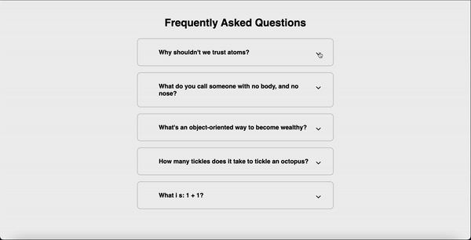

# FAQ_Collapse
A responsive web application that allows users to toggle and collapse frequently asked questions.

## Preview

## Features

- Displays a list of frequently asked questions.
- Allows users to toggle and collapse individual questions to reveal or hide the answers.
- Provides a smooth and animated transition when expanding or collapsing questions.

## Technologies Used

- HTML
- CSS
- JavaScript

## Usage

1. Clone the repository: `git clone https://github.com/Lincoln2303/FAQ_Collapse.git`
2. Open the `index.html` file in a web browser.
3. Click on a question to expand or collapse the answer.

## License

This project is licensed under the [MIT License](LICENSE).

## Acknowledgements

The project is part of the "50 projects in 50 days - HTML, CSS & Javascript" course on Udemy by Brad Traversy.
